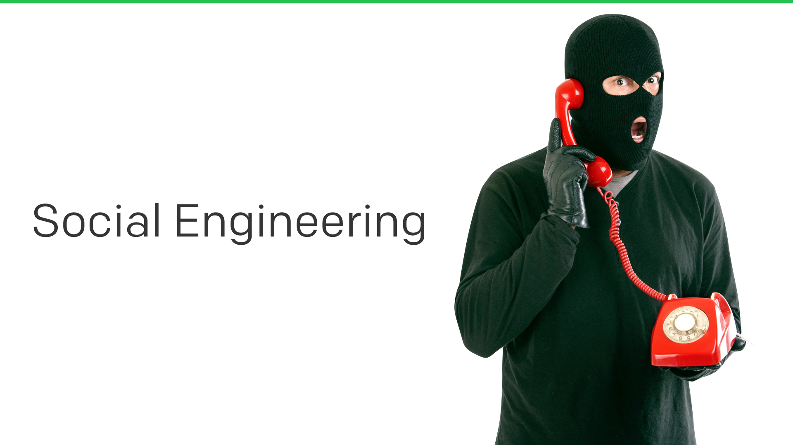
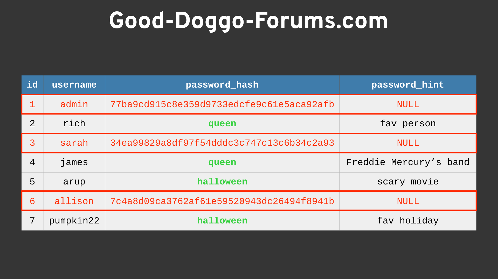

---

### Introduction

<input type="checkbox" id="001" /><label for="001"></label>
_001. "Security Training for Everyone"_

Welcome to the Security Training for Everyone section. This training will be painless, quick, and hopefully informative as well. 

It's worth noting that this training is _mandatory_ for all staff. Vidyard has obligations to staff, customers, and investors to uphold the standards set by our security program. One such obligation is ensuring that our staff are knowledgeable and equipped to deal with security issues that inevitably arise in the course of modern business. 

---

### Tracking Attendance

<input type="checkbox" id="008" /><label for="008"></label>
_008. Blue._

In the past I have tracked your enthusiastic participation by sending out a quiz with silly questions that still made you look in our policy documents. This year instead, as per PagerDuty's session, you will receive a quiz with only two questions. Pay attention as you read through these, and the answers will be super simple and obvious to you in the end. Good luck!

(And yes, I know you can cheat by scouring through the file looking for the two simple answers instead of reading the whole presentation. I have a way of knowing that this was done, and anyone who does this will be asked to complete a SIG Lite, VSAQ, and CAIQ questionnaire on Vidyard's environment >:) ). 

To track your own progress as you go, you can click the slide to mark it as "done". 

---

### Goal

<input type="checkbox" id="002" /><label for="002"></label>
_002. Goal of the training._

Why do you need to know about security threats? We have a security team, don't we? 

In theory, I could design a system and network that would be very-nearly impenetrable by even the most Elite Criminal Underground Hacker Organization. It could have so many fences, armed guards, gated entrances, cameras, and drones equipped with tazers. 

But it wouldn't be usable or useful. It would be a giant fortress of inconvenience. You'd hate it, I'd hate it, customers would hate it. 

Those inconveniences need to be removed and managed so that we can operate and function. This is where you come in. When these inconvenient protections are removed, we open a door into our otherwise protected fortress. It's up to you to understand the risks of how to operate that door, what risks exist for that door, and how to report when that door isn't functioning as it should. 

---

### The Role of Vidyard's Security Team

<input type="checkbox" id="007" /><label for="007"></label>
_007. Our job as a security team._

So that's going to be a lot of stuff that YOU have to look after. What exactly does the security team do then? 

Vidyard's Security Team researches the current state of technology, threats, services, and news, and condenses them into a suite of policies and solutions that Vidyard can use internally. 

Our security team also builds tools and processes that act as safety nets for when expected events occur. We analyze the threat model to our business and design controls to mitigate or eliminate these risks. 

The goal of these policies, processes, and services, is to make it easy for you to do your work function without having to think too hard about the associated security risks. 

---

### Security Is HARD

<input type="checkbox" id="014" /><label for="014"></label>
_014. What is security theater? [Reference](https://en.wikipedia.org/wiki/Security_theater)_

This is where you spend (_waste_) time and effort on things which merely give the _appearance_ of improved security, without actually providing it. This comes in multiple forms, but my favourite has always been when someone buys a firewall and puts it into their environment to tick the box on their audit. Did anyone actually read the 800 page manual? Did a team actually sit down and discuss a security profile to be implemented? Did anyone ACTUALLY _ImPLeMeNt_ IT?!

Some security functions and concepts are challenging to understand and implement. This can present resource issues, or it can be downright scary. It might feel easier to simply skip that part and simply hope nothing bad happens....  

Vidyard's Security Team is here to help provide guidance and direction on implementation for any software, hardware, or service, whether directly related to security or not. 

Don't fake it when we can help you make it! 

---

### Be Secure, But Usable

<input type="checkbox" id="011" /><label for="011"></label>
_011. Be secure, but usable._

Our job is to strike a good balance between security and convenience. We want to make sure that Vidyard as a product, and as an office environment, is both secure and usable. Our goal is not to add friction to your day-to-day jobs, but we can't sit entirely at the convenience end of the spectrum either. Certain security functions need to exist to provide us all with continued employment by protecting our brand, our systems, and our staff from harm and damages. 

---

### Social Engineering

_<input type="checkbox" id="017" /><label for="017"></label>_

Let's get on to the meat of the presentation. And to start, this stock photo. 

---

### What is Social Engineering?

<input type="checkbox" id="018" /><label for="018"></label>
_018. What is social engineering? [Reference](https://en.wikipedia.org/wiki/Social_engineering_(security))_

For those who've not heard the term before, here's a quick definition of what social engineering is. Basically it's a type of confidence trickery. Convincing people to give up information either without them realizing it, or by making them believe you're someone else.

If you think that this is a hard thing to pull off, next time someone you know needs to change their utility bill, ask if you can call in for them. Armed with their birthdate, and name, you can call in once to gather more information on them, such as their last bill amount or previous addresses. Then call in again, get another agent, and use that information to get their current address or last 4 digits of their credit card. Then call back in and cut off their electricity as a harmless prank! #lol 

---

### Building Trust

<input type="checkbox" id="020" /><label for="020"></label>
_020. Building Trust._

Social engineering is about building trust, obtaining information, and ultimately building a believable persona and story. 

This is hard to defend against, since human nature is to want to help others. 

So if someone contacts you claiming to be an employee, and you've never heard of them before, verify they are who they say they are via another channel. If they email you, ping them on Slack to check (and vice versa). Zoom call to see their face, and if they refuse, maybe it's time to ring Vidyard Security!

---

### Phishing

_<input type="checkbox" id="022" /><label for="022"></label>_
_022. _Phishing._

I'm going to focus on one particular type of social engineering attack that we get exposed to, phishing (with a P-H). The term comes from "fishing for information", and generally involves receiving an email designed to trick you into giving up information. As we get larger as a company, we become more of a target for these types of attacks.

How many of you have received an email claiming to be from Michael Litt ( <user348671234@hackedmail.ru> ) asking you to wire money to him right away? Yeah, that's not actually Mike...

---

### Is My Credit Card Stolen?

<input type="checkbox" id="024" /><label for="024"></label>
_024. ismycreditcardstolen.com._

But you don't even have to send emails to people, sometimes you can just lay a trap and people will gladly provide you with information instead. Here's a great website, ismycreditcardstolen.com. You just enter your credit card information, and it'll helpfully tell you if it's been stolen or not. Of course, as soon as you enter the details, your credit card information has in fact been stolen.

But it has that nice "Verified Secure", with the padlock and green tick, so it must be OK, right?

---

### Protecting Yourself

<input type="checkbox" id="039" /><label for="039"></label>
_039. Protecting yourself._

Our mailing servers have spam protection, spoof protection, and various other detection mechanisms. That said, sometimes the odd little piece of EVIL gets through. Remember when we talked about convenience vs security? It's better to let a bit of EVIL in and deal with it, than it is to lose the chance at a connection with a prospect or customer! 

If you suspect you've received a phishing attempt, send it on over to helpdesk@vidyard.com for archiving and trending. Our teams can also verify through some technical processes whether the email is valid or not. 

Finally, remember to **never click on any links in a mail you think may be phishing**.

---

### Passwords

<input type="checkbox" id="048" /><label for="048"></label>
_048. What are passwords?_

Passwords, passphrases, PINs, secret keys. These are all strings of characters, numbers, and symbols that are stored on a system or service that grant access to those who know it. 

If kept secret and safe, the system or service will remain perfectly secure forever! 

Or will it....?

---

### Cracking Passwords 101

<input type="checkbox" id="049" /><label for="049"></label>
_049. Today we are going to learn how to crack passwords_

I'm not usually the type of person to cry doom and despair, or instill fear into those within earshot of my soapbox. But when it comes to passwords, I most certainly do. 

Why? Because everyone reuses their passwords. And when you reuse a password at Vidyard that you also used on good-doggo-forums.com, our security now relies on good-doggo-forums.com to keep their information secure. 

To illustrate this, some technical background must be explored. 

---

### Hashing

<input type="checkbox" id="050" /><label for="050"></label>
_050. Hashing. [Reference](https://en.wikipedia.org/wiki/Cryptographic_hash_function)_

We'll start with something called "Hashing".

This magic process takes the password you entered when you create an account, and turns it into a garbled-looking string. This new string is irreversable (you can't figure out what password created it), but it's repeatable (if you enter the same password again, you get the same string). 

---

### Matches?

<input type="checkbox" id="057" /><label for="057"></label>
_057. Did you enter the same thing?_

This is really handy because your actual password never needs to be stored. If you enter the same password to login that you created when you made your account, those two garbled-looking strings will be identical and that's all the security system needs to know in order to consider you authenticated. 

---

### They're good dogs, Bront.

<input type="checkbox" id="058" /><label for="058"></label>
_058. Good-doggo customer database._

Let's pretend we just social-engineered Good-Doggo-Forums.com and we were able to get the password from one of their developers by promising to send them 40 Bitcoins if they logged in. With that password, we logged into their database and exported the users table. 

Sweet! Now we have a huge list of every username and hashed password! But, didn't I say those passwords were _irreversible_? I did! So, aren't these password hashes, useless? They are! But, with some clever work, watch what we can do. 

First, let's take a look at that list and look for duplicates. It looks like _arup_ and _pumpkin22_ both have the same hash. Remember, hashing is a repeatable process, so these two passwords must be the same. Now look at the password hint column. Scary movie? Fave holiday (for username pumpkin22?). 100% this password is "halloween". 

Next, _james_ and _rich_ both have the same password. Their hints are "fav person", and "Freddie Mercury's Band". Well, my guess is that _rich_ likes the british monarchy, and both of these passwords are "queen". 

You might think these examples are far-fetched, but most people don't ever think anyone would ever look or see their password hints, and they make these really, really easy. In some cases, people put their PASSWORDS into this field. I kid you not. 

---

### Let's get brutal

<input type="checkbox" id="065" /><label for="065"></label>
_065. No more hints._

So we've exhausted all the hints, and we're left with a bunch of hashed passwords. Either we give up now and use the passwords we've obtained, or.. in the spirit of 1337 hax, we're going to get that admin password, and the rest of them while we're at it. 

We're going to use [Rainbow Tables](http://project-rainbowcrack.com/table.htm). These are massive pre-computed lists of passwords that have been run through the hashing process already, and now we just take those strings in the password field and search for them in the rainbow tables. 

On modern computers with a modest graphics card, we can whip through several trillion hashes per second in our search through the rainbow tables. This is called BRUTE FORCING a password. Sort of like banging a padlock with a sledgehammer until it opens, but not quite as loud. 

---

### Cracked

<input type="checkbox" id="074" /><label for="074"></label>
_074. Cracked._

And we've done it. The passwords left over in this password list were quickly found using rainbow tables. 

Now that this password file has been cracked wide open, what do we do with it? Well, a common thing to do is to sell this file for a few BTC or XMR on the DarkWeb, where someone can anonymously purchase and download it for their own uses. Or, if we just want to watch the world burn, we would just post it to pastebin.com and let folks on Reddit have at it. 

Let's say that this database has an email address field. Let's say further that you, as an employee of Vidyard, use your work email to sign up to good-doggo-forums.com. Let's further suppose that you re-use passwords. 

See where I'm going here? 

---

### What happens when passwords are leaked?

<input type="checkbox" id="078" /><label for="078"></label>
_078. What happens when passwords are leaked? [Reference](https://hotforsecurity.bitdefender.com/blog/1800-minecraft-usernames-and-passwords-leak-online-11209.html)._

These breaches happen all the time, and email/password combinations get released publicly all the time. Ever wonder why passwords expire, or have complexity requirements? Now you know. 

---

### Best Practices

<input type="checkbox" id="079" /><label for="079"></label>
_079. Best practices._

I'm going to skip a lot of password policy suggestions here and share a comic that I'm sure many of you have seen before. 

One of the changes I will bring in 2021 to our password policy is to drop the requirement for symbols and numbers, and instead increase the required length of our passwords to 25+ characters. Following the passphrase method in this comic would give you a password you can remember that's very unlikely to be found in those rainbow tables. (Trust me, "correct horse battery staple" is going to be in there though).

Another approach is to ensure that you have enabled MFA (multi-factor authentication). With MFA enabled, an attacker needs your password, AND your MFA device. It's unlikely they will have both. 

But, if re-using passwords is bad, how will you remember all of those different passwords?

---

### Use a Password Manager

<input type="checkbox" id="089" /><label for="089"></label>
_089. Use a password manager. [Reference](https://1password.com/)_

You need to use a tool called a "Password Manager". There are lots out there, and you've probably heard of a lot of them. "[LastPass](https://www.lastpass.com/)", "[1Password](https://1password.com/)", "[KeePass](https://keepass.info/)", etc. They each have their own pros and cons depending on how you prefer to operate. Most have browser plugins to automatically enter your passwords for you (although there have been some security issues there in the past). But they're all designed to do pretty much one thing. Store a lookup of all your usernames and passwords, protected by a single "master password", which is the one password (hey, that's the name of one of the tools) you need to remember. The idea is that it'll be the last password (hey, that's the name of another one!) you need to remember.

If there's only one thing you take away from today's training, please make it this: Using a password manager is the single most effective thing you can do to enhance your security online. Actually, maybe multi-factor authentication too...

---

### Multi-Factor In Plain English

<input type="checkbox" id="102" /><label for="102"></label>
_102. Multi-Factor. [Reference](https://en.wikipedia.org/wiki/Multi-factor_authentication)_

In the field of authentication, there are three main types of evidence (or "factors") you can provide. These are called "Knowledge", "Possession", and "Inherence". 

In plain English, that's Something you know, Something you have, and Something you are.

So, something you know would be a password. Something you have would be your phone, or a physical object. And something you are would be a fingerprint, or some other form of biometrics.

---

### Two-Factor

<input type="checkbox" id="104" /><label for="104"></label>
_104. Two-Factor._

The idea of two-factor authentication is that you pick two of these factors, and require them in order to authenticate a user. While an attacker might be able to remotely steal your password, it's pretty unlikely they'd also be able to physically steal your phone or get a fingerprint. Likewise, if an attacker can physically steal your phone, it's unlikely they'd also be able to get your password.

Some password managers let you store the two-factor secrets with the passwords. You do still gain some security advantages there. But it's much better to keep your two-factor codes in a separate password manager. Then if your original master password is broken, an attacker only gets one.

This all applies to backup codes too. Typically you should just print those off and put them somewhere safe. They're your absolute failsafe.

---

### What is physical security?

<input type="checkbox" id="109" /><label for="109"></label>
_109. What is physical security?_

It's important to keep our office environment secure, we don't want random folks wandering around stealing information or equipment. If you see someone you don't recognize acting suspicious, just ask questions. Introduce yourself and make a new friend, since 99% of the time it's going to be a new employee or a guest of another Vidyardian. 

If their answers don't satisfy you, and you think they're sketchy, alert the security team and we'll take care of it. Don't put yourself in danger, and leave if you feel uncomfortable. We are trained in various forms of martial arts and have weapons stored in the server room for dealing with advanced threats such as extra-terrestrial militias. Just kidding, we'll call the cops. 

---

### Ask Questions

<input type="checkbox" id="110" /><label for="110"></label>
_110. Ask Questions._

If you see something suspicious, ask questions. But be polite, don't shove someone up against the wall shouting "Who do you work for!!?!?!", this isn't a movie. If someone is wandering around looking lost, ask them where they're heading. It's likely just a new employee.

If someone you don't recognize is sitting at your friends desk using their laptop though, that's something you probably want to let the security team know about pretty quickly. Speaking of which...

---

### Lock Your Computers!

<input type="checkbox" id="111" /><label for="111"></label>
_111. Lock Your Computers!._

Please lock your computers when you're not with them. It literally only takes a few seconds for someone to plug in a USB stick and they've now loaded malware on to your machine.

If you wander around the office and see someone else's computer unlocked, please lock it for them, then send them a private message on Slack letting them know it was unlocked and that you locked it. Resist the urge to troll the user by changing their background or typing as them on Slack. That's not the kind of environment we're trying to foster.

Also we used to do that, and it just makes people feel bad and doesn't give you the results you want.

---

### Piggybacking

<input type="checkbox" id="112" /><label for="112"></label>
_112. Piggybacking._

Beware of "Piggybacking", this is where someone else follows you through a secure door on your keycard swipe. A common social engineering trick is to just act like you belong and follow people through a door they've opened for you. Usually carrying something heavy with both hands to explain why they can't swipe their own keycard.

Always verify other people coming in on your keycard. If they're co-workers you recognise, then of course let them in. But if you don't recognise them, ask them to tap their own keycard too. Then introduce yourself, and make a new friend, since it's a coworker you'd not met yet.

Likewise, if you're following someone through a door and they ask you to tap your keycard, please don't give them any grief. Tap your keycard, and then introduce yourself and make a friend.

---

### Building Keycards

<input type="checkbox" id="113" /><label for="113"></label>
_113. Building Keycards._

Speaking of keycards, please keep them with you at all times. Don't leave them at your desk. You've no doubt noticed that keycards are required on all doors that access the building.

As we grow as a company, we're probably going to need to start putting photos on the keycards too. Although I personally question the effectiveness of that, since most people don't look at name badges anyway. Also we want to make sure not to put the company name on the keycard, otherwise it gives away where the keycard can be used when it gets lost. It'd be like putting your home address on your house key.

I started a hackday a while back to make our keycards nicer, but never followed through. Who knows what they'll eventually look like.

---

### Building Security

<input type="checkbox" id="114" /><label for="114"></label>
_114. Building Security._

Once you've used your keycard to unlock a door, please don't prop it open. The doors are locked for a reason, and propping them open kind of defeats that. Listen for the sound of the door closing behind you.

Make sure all your visitors sign in at the front desk, and have a name badge. Not only is this good security practice, but it's required for fire safety too, so we know how many people are in the building should we need to evacuate.

---

### Laptop Stolen?!

<input type="checkbox" id="115" /><label for="115"></label>
_115. Laptop stolen?!._

So you're at a bar after work, you look down on the floor and see that your backpack has been stolen, and your PagerDuty issued laptop was in there. It was likely stolen by someone wearing a balaclava, since we know that's what all criminals wear based on my stock image searches.

What do you do?

---

### Panic?

<input type="checkbox" id="116" /><label for="116"></label>
_116. Panic?._

Your first instinct is to probably panic. That's OK, it's a natural reaction.

---

### Don't Panic

<input type="checkbox" id="117" /><label for="117"></label>
_117. Don't Panic._

But don't panic. Things get stolen, it's just the world we live in. You're not going to get fired, you're not going to get into trouble.

_(Unless you stole the laptop yourself, in which case, yeah.. you'll probably get into trouble)._

---

### Page Security

<input type="checkbox" id="118" /><label for="118"></label>
_118. Page us!._

Page security or helpdesk at any time if you have lost or had stolen, any devices that access PagerDuty information. Whether it's your PagerDuty issued laptop, or your personal phone which was logged into your GitHub account. Let us know immediately so we can lock it out from all our systems and get you a new device issued.

This is a high-urgency pageable situation. So if you spot your stolen device at 2am, you page us at 2am. Don't wait until business hours. We always have someone on-call who will respond to these pages and take the necessary action.

If you don't know how to page us via PagerDuty, please come and talk to us as soon as you can so we can show you. Hopefully you've all at least used our product once, but some of you are pretty new and probably haven't had the chance yet, that's OK.

---

### Personally Identifiable Information (PII)

_<input type="checkbox" id="119" /><label for="119"></label>_
_119. Personally Identifiable Information (PII)._

The next topic is Personally Identifiable Information, usually abbreviated to PII, or sometimes just PI.

---

### What is PII?

<input type="checkbox" id="120" /><label for="120"></label>
_120. What is PII?_

This is any information that can be used to identify a single person in context. By that I mean, it's no good just to be able to tell that certain data belongs to a single human, you have to be able to identify that particular human out of all the others that exist.

---

### Basic Guidelines

<input type="checkbox" id="121" /><label for="121"></label>
_121. Basic Guidelines._

We have some basic guidelines when it comes to personal information at PagerDuty. First of all, don't discuss company information in public. The number of times I overhear conversations out in the world from folks at other companies discussing things they really shouldn't be is astounding. Please don't do the same.

Don't look at information you shouldn't. Let's say you come across a list of employees and their SSN's. That's pretty bad, and is something we want to know about. Don't just scroll through the data and keep it to yourself. Let us know immediately so we can do something about it. Just like with stolen devices, you won't get into trouble for accessing something you shouldn't have access to if it was an honest mistake. But if you look at that information and don't tell anyone, then later we find out you accessed it, that's going to cause problems.

All company devices are encrypted by default when you get them. Don't turn this off. We give you administrative access to your laptops because we want you to have the ability to do whatever you need with them to get your job done. Turning off encryption is not one of them.

Finally, we need to be careful with company data. What is company data you might ask.

---

### Company Data?

<input type="checkbox" id="122" /><label for="122"></label>
_122. Company Data?_

It's not this type of data. It's the data we store in our systems that allow us to run our business.

---

### Data Classification

<input type="checkbox" id="123" /><label for="123"></label>
_123. Data classification._

We have three distinct types of data at PagerDuty.

* *General Data* is anything that is _intentionally_ available to the public. The key being intentionally. If something gets leaked, it doesn't automatically become general data.
* *Business data* is anything used to operate our business. Examples would be our employee list, payroll information, etc.
* *Customer data* is any data provided to us by the customer.

Customer data is by far the most valuable and protected data we have at PagerDuty, and is subject to our most stringent security rules.

---

### Data Handling

<input type="checkbox" id="124" /><label for="124"></label>
_124. Data handling._

How we handle data depends on what type of data it is. For example, general data does not need to be encrypted, as it's considered public. All other types of data should always be encrypted in transit and at rest however.

You can view a more detailed description of our data handling policies on the wiki.

???+ warning "Redacted Content"
    When originally presented, this slide contained links to our internal wiki with more detailed information. Those internal links have been removed from the public version.

---

### Wiki Page Classifications

<input type="checkbox" id="125" /><label for="125"></label>
_125. Wiki page classifications.._

Speaking of the wiki, you will notice that every link in the security wiki has a coloured label next to it which identifies which classification that particular link or file is subject to, and how it can be disseminated.

* *Public* can be shared with anyone.
* *Restricted* is only to be shared with customers who are under an NDA.
* *Internal only* are not to be shared with anyone outside of PagerDuty.

If any link does not have a classification, it is to always be considered internal only.

You'll also notice that these classifications exactly match the ones used for these slides!

---

### Personal Devices

<input type="checkbox" id="126" /><label for="126"></label>
_126. No PagerDuty data on personal devices._

When it comes to handling data, it's important to make sure that certain data never leaves our secured environments.

We do not allow any PagerDuty data to be stored on your personal devices. This means you do not clone a PagerDuty git repository to your personal device, and you do not download sales contracts or employee lists to your personal devices.

This does not mean you can't check your email from your phone. Any website or hosted platform is perfectly fine to access from your personal devices. You should never be downloading and storing anything on your phone that is PagerDuty related however.

If you're unsure what counts as a hosted platform, just ask us!

This is also why it's important for you to let us know if your personal device is lost or stolen, so we can lock it out from all our services.

---

### PagerDuty Devices

<input type="checkbox" id="127" /><label for="127"></label>
_127. No customer data on PagerDuty devices._

Likewise, you should never store customer data, even on PagerDuty devices! Customer data is never to leave our production environment under any circumstances.

That means you do not download parts of our production database to your PagerDuty laptops, you do not transfer real production data to our staging or sandbox environments to run some tests, etc. Our production environment has strict security controls and audit logging in place. If you transfer data away from those environments, we  lose those abilities.

We have analytics mechanisms available to you in our production environment to run these types of things. If you need something different or special set up for a specific project, please let us know and we're more than happy to guide and help you set that up.

---

### Be Mindful

<input type="checkbox" id="128" /><label for="128"></label>
_128. Be Mindful._

The takeaway from all of this is that you should be mindful of how you handle data. Treat customer data as you would want your own data to be treated. Like I said earlier, customer data is our most valuable asset, and customers are trusting us with it. Breaching that trust is unacceptable, and so we all need to make sure we follow the rules.

If you’re not sure how to treat certain data, just ask us! Maybe it’s a case we hadn’t considered yet, and something we need to create a policy for.

---

### Compliance

_<input type="checkbox" id="129" /><label for="129"></label>_
_129. Compliance._

OK, we're on to our final topic. Compliance.

???+ comment "Presenter's Comment"
    If you don't know what that background image is about, go and watch a cheesy 80's sci-fi movie called "[Flight of the Navigator](https://www.imdb.com/title/tt0091059/)".

We have a variety of compliance restrictions that affect how we operate, so I want to spend a bit of time talking about each of them.

---

### GDPR

<input type="checkbox" id="130" /><label for="130"></label>
_130. GDPR._

The first one is GDPR. This stands for General Data Protection Regulation and is a new European law coming into effect later this year. I'm required to tell you that this exists, and is a thing.

...

Just kidding, of course I'm going to go into more detail.

---

### GDPR

<input type="checkbox" id="131" /><label for="131"></label>
_131. GDPR. [Reference](https://www.eugdpr.org/)_

GDPR goes into effect on 25th May 2018, and has very strict rules for how personal information should be handled, with big fines for those who don't follow the rules. We will be subject to GDPR, as we handle data for users who are EU citizens.

We are mostly considered a "Data Processor" under GDPR, rather than a Data Controller. Our customers are the data controller (they control the data of their employees), and we process their data on their behalf. Any customers who are subject to GDPR as controllers will need to execute a Data Processing Agreement (DPA) with us if we are to continue processing their data. Since we also have third-parties which process customer data on _our_ behalf (for example, our notification and telephony providers), we will also need to execute DPA's with them. It's worth noting that there are also a few cases where we would be considered a Data Controller, such as for our UK based employees.

We'll need to include extra steps in our development processes to include data protection from the onset of designing our systems, rather than something that's added on later.

Data portability is the right for a data subject (i.e. our users) to receive the personal data we have stored which concerns them. We need to provide this in a "commonly used and machine readable format". The user also has the right to transmit that data to another controller. Our current API satisfies this constraint, since it allows users to retrieve all the information we have on them, and they can export it and send it to another provider as they see fit.

Another thing GDPR requires is the "Right to be Forgotten", also known as Data Erasure, this entitles the data subject to have the data controller erase his/her personal data, cease further dissemination of the data, and potentially have third parties halt processing of the data. We already allow customers to purge their information from PagerDuty on request, so again, we already satisfy this constraint.

One very important part is that we have to specify the intended purpose of all personal data we will process, and cannot use that data for any other purpose. For example, if we specify the intended purpose of collecting email addresses is to send PagerDuty notifications, we cannot then use that email address to send the user marketing material.

And there are very hefty penalties for any breach of GDPR. 4% of annual global turnover, or €20 Million, whichever is greater.

There are more things involved with GDPR that I’ve gone over here, such as “Consent” and “Profiling”, etc. The link at the bottom has more information if you’re interested.

---

### Dear Santa

<input type="checkbox" id="132" /><label for="132"></label>
_132. Dear Santa... [Reference](https://twitter.com/pwnallthethings/status/945353758137049088)_

The bottom line is that GDPR is going to lead to a lot of interesting situations in the industry.

---

### More Compliance

<input type="checkbox" id="133" /><label for="133"></label>
_133-135. Redacted slides._

???+ warning "Redacted Content"
    A series of slides here went into detail on our other compliance initiatives. These initiatives are still being worked on and so we're unable to share the information publicly.

---

### Would you like to know more?

_<input type="checkbox" id="136" /><label for="136"></label>_
_136. Would you like to know more?_

And that's it! All of the topics I had. I hope you all learned something useful, and if not, I hope you at least had a laugh at some of the jokes. If you want to know more about any of the material here, or anything security related that I didn't get a chance to cover, here are some ways you can find out more.

---

### Contact Security Team

<input type="checkbox" id="137" /><label for="137"></label>
_137-139. Redacted slides._

???+ warning "Redacted Content"
    These slides gave an overview of how folks can reach the security team, and links to our internal wiki pages, Slack rooms, and details on when we run office hours.

---

### Llama

<input type="checkbox" id="140" /><label for="140"></label>
_140. Llama._

And for all of you waiting for the animal to go with the colour from the start, it's a Llama. So you'll be getting a feedback survey in a few moments, just enter the colour from the start, and this animal, and that will "prove" that you attended the security training for this year.

You'll also have a chance to provide feedback on the training, which will shape how we change it next year. I will assume any negative feedback about my jokes are all in jest.

---

### Questions?

<input type="checkbox" id="141" /><label for="141"></label>
_141. Questions?_

So with that, I'll open it up to questions. Thanks very much!

???+ comment "Presenter's Comment"
    If you have questions about this training material, feel free to ask me on Twitter, I'm [@r_adams](https://twitter.com/r_adams).

---

### Image Credits

<input type="checkbox" id="142" /><label for="142"></label>
_142. Image credits._

???+ info "Information"
    Here are the credits for all the images used throughout this training.

---

!!!question "Spotted a Problem?"
    Security is hard, and we're not perfect. There may be mistakes or misunderstandings in this training material. If you find a problem, please help us correct it! This project is [open-source on GitHub](https://github.com/pagerduty/security-training) and we appreciate all friendly contributions.

*[SRE]: Site Reliability Engineering
*[NDA]: Non-Disclosure Agreement
*[ISP]: Internet Service Provider
